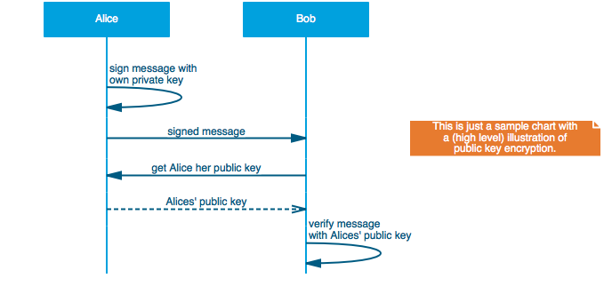

# mscgen_js - command line interface

[][travis.mscgenjs]
[][codeclimate.mscgenjs]
[](http://codecov.io/github/sverweij/mscgenjs-cli?branch=master)
[](https://david-dm.org/sverweij/mscgenjs-cli)
[](https://david-dm.org/sverweij/mscgenjs-cli#info=devDependencies)
[](https://npmjs.org/package/mscgenjs-cli)
[](LICENSE.md)

## What's this do?
- It makes sequence charts (in svg, png or jpeg) from your [MscGen][mscgen]
  scripts. From the command line.
- It also does so for your Xù and MsGenny scripts.
- There's a boatload of other things it can do - see below.

### Cool. How do I install it?
```sh
npm install --global mscgenjs-cli
```

### How do I use this?
```sh
mscgenjs coolchart.mscgen
```
This will generate `coolchart.svg` from [coolchart.mscgen](samples/coolchart.mscgen):



### But I want png's!
```sh
mscgenjs -T png coolchart.mscgen
```

### But ...
- But isn't it more practical to have an **interactive interpreter** for this?   
  When you **edit** sequence charts: definitely!
  - Scoot over to [mscgen_js][mscgen_js] for an on line interpreter.
  - If you're using [atom][atom] you'll _**love**_ the
    [mscgen-preview][mscgen-preview] package.
- But there's also the **original** [`mscgen`][mscgen].     
  - Yes there is. The original is a _lot_ faster too. And it's the reference
    implementation for MscGen.
  - It also provides .eps as an output format, which mscgenjs doesn't.
- So, why should I use this instead?    
  - mscgenjs understand Xù or MsGenny - so if you'd want
    to use things like **alt** or **loop** you can just do that.
  - It converts to **other formats**, a.o. to graphviz `dot` so you can present
    your chart as a directed graph.
  - mscgenjs' graphics look a bit different - you might like em better
    (but then again, you might not)

### More options?

Yes. Run `mscgenjs` with `-h` or `--help` to get them all:

```
  Usage: mscgenjs [options] [infile]

  Options:

    -h, --help               output usage information
    -V, --version            output the version number
    -T --output-type <type>  one of svg|png|jpeg|mscgen|msgenny|xu|dot|doxygen|json
    -I --input-type <type>   one of mscgen|xu|msgenny|json
    -i --input-from <file>   File to read from. use - for stdin.
    -o --output-to <file>    File to write to. use - for stdout.
    -p --parser-output       Print parsed msc output
    -l --license             Display license and exit
```

Writing to stdout currently only works for non-graphical output formats
(mscgen, msgenny, xu, dot, doxygen, json) and svg.

### Basic use: produce pictures from a script
This will generate a sequence chart called `intro02_starter.svg` in the
same directory as the `intro02_start.mscgen` script
```sh
mscgenjs intro02_starter.mscgen
```

If you want to have the output go somewhere else, specify it:
```sh
mscgenjs -o othername.svg intro02_starter.mscgen
```

`mscgenjs` will try to guess the type of script from the extension. Here
it will guess the input to be Xù. If it doesn't know, it'll assume it got
MscGen passed.
```sh
mscgenjs test51_with_alt.xu
```

If you want to override the guessing use -I, so to force the input to be
parsed as MscGen:
```sh
mscgenjs -I mscgen test51_with_alt.xu
```


### Conversion
When presented with an output file name, `mscgenjs` will try to guess the
type of output desired from the extension.
```sh
mscgenjs w00t.xu -o myoutput.png # writes a chart in png format to myoutput.png
mscgenjs w00t.xu -o flatter.msc # downconverts w00t.xu to MscGen to flatter.msc
```

With `-T` (or `--output-type` you can specify the type of output if you want
to override the output type. By default `mscgen.js` assumes _svg_.

Some other formats:

To convert an Xù or MsGenny script with advanced options back to
vanilla MscGen (without advanced options):
```sh
mscgenjs  -T mscgen -i funky.xu funky.mscgen
```

To convert an MscGen script to _graphviz dot_:
```sh
mscgenjs -T dot -i intro02_starter.mscgen intro02_starter.dot
```

To convert to raster graphics ('png' and 'jpeg')
```sh
mscgenjs -T png -i dolores.mscgen -o dolores.png
```

For text based formats you can also send specify standard output as a
destination, so you can pipe the output to something else.
E.g. to graphviz dot to further process a dot program:
```sh
mscgenjs -T dot -i intro02_starter.mscgen -o - | dot -Tsvg > communicationsdiagram.svg
```

### Parser output and input
To show how the parser interpreted your input into an abstract syntax tree use
the `-p` option
```sh
mscgenjs -p -o parsed.json intro02_starter.mscgen
```

You can in turn render the abstract syntax tree by specifying it as input
type:
```sh
mscgenjs parsed.json
```

## What is the license?
[GPL-3.0](LICENSE.md)

## How does mscgenjs render?
- It uses the (pure javascript) [mscgen_js][mscgen_js] library.
- For graphical formats (svg, png, jpeg) it uses mscgen_js in phantomjs.
  If you want to know why, or want to know other gory details:
  [src/README.md](src/README.md) tries to explain that.

[mscgen]: http://www.mcternan.me.uk/mscgen
[atom]: https://atom.io
[codeclimate.mscgenjs]: https://codeclimate.com/github/sverweij/mscgenjs-cli
[mscgen-preview]: https://atom.io/packages/mscgen-preview
[mscgen_js]: https://github.com/sverweij/mscgenjs-core
[travis.mscgenjs]: https://travis-ci.org/sverweij/mscgenjs-cli
