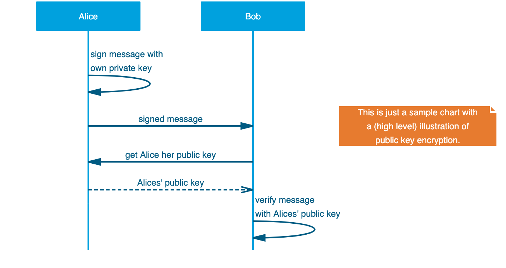
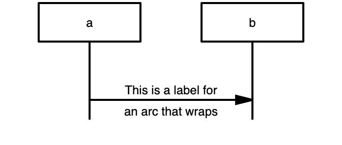
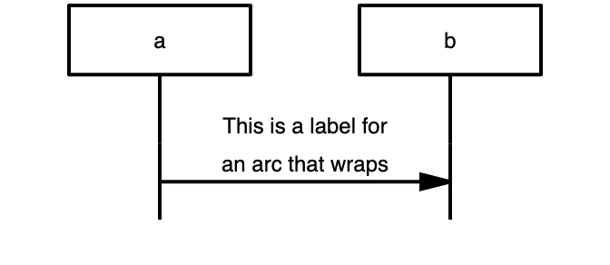

# mscgen_js - command line interface
_Render sequence charts from the command line_

[][travis.mscgenjs]
[][bithound.mscgenjs]
[](https://david-dm.org/mscgenjs/mscgenjs-cli)
[](https://david-dm.org/mscgenjs/mscgenjs-cli#info=devDependencies)
[](https://npmjs.com/package/mscgenjs-cli)
[](https://npmjs.com/package/mscgenjs-cli)
[](LICENSE.md)

## What's this do?
- It makes sequence charts (in svg, png or jpeg) from your [MscGen][mscgen]
  scripts. From the command line.
- It also does so for your Xù and MsGenny scripts.
- There's a boatload of other things it can do - see below.

### Cool. How do I install it?
```sh
npm install --global mscgenjs-cli
```

### How do I use this?
```sh
mscgenjs coolchart.mscgen
```
This will generate `coolchart.svg` from [coolchart.mscgen](samples/coolchart.mscgen):



### But I want png's!
```sh
mscgenjs -T png coolchart.mscgen
```

### But ...
- But isn't it more practical to have an **interactive interpreter** for this?   
  When you **edit** sequence charts: definitely!
  - Scoot over to [mscgen_js][mscgen_js] for an on line interpreter.
  - If you're using [atom][atom] you'll _**love**_ the
    [mscgen-preview][mscgen-preview] package.
- But there's also the **original** [`mscgen`][mscgen].     
  - Yes there is. The original is a _lot_ faster too. And it's the reference
    implementation for MscGen.
  - It also provides .eps as an output format, which mscgenjs doesn't.
- So, why should I use this instead?    
  - mscgenjs understand Xù or MsGenny - so if you'd want
    to use things like **alt** or **loop** you can just do that.
  - It converts to **other formats**, a.o. to graphviz `dot` so you can present
    your chart as a directed graph.
  - mscgenjs' graphics look a bit different - you might like em better
    (but then again, you might not)

### More options?

Yes. Run `mscgenjs` with `-h` or `--help` to get them all:

```
  Usage: mscgen_js [options] [infile]

  Options:

    -V, --version                    output the version number
    -T --output-type <type>          svg|png|jpeg|mscgen|msgenny|xu|json|ast|dot|doxygen
    -I --input-type <type>           mscgen|msgenny|xu|json|ast
    -i --input-from <file>           File to read from. use - for stdin.
    -o --output-to <file>            File to write to. use - for stdout.
    -p --parser-output               Print parsed msc output
    -s --css <string>                Additional styles to use. Experimental
    -n --named-style <style>         basic|lazy|classic|noentityboxes
    -m --mirror-entities             Repeat the entities on the chart's
                                     bottom
    -v --vertical-alignment <align>  Vertical alignment of labels on regular
                                     arcs. Experimental
                                     above|middle|below (default: middle)
    --puppeteer-options <file>       (advanced) pass puppeteer launch options
                                     see README.md for details
    -l --license                     Display license and exit
    -h, --help                       output usage information
```

### Basic use: produce pictures from a script
This will generate a sequence chart called `intro02_starter.svg` in the
same directory as the `intro02_start.mscgen` script
```sh
mscgenjs intro02_starter.mscgen
```

If you want to have the output go somewhere else, specify it:
```sh
mscgenjs -o othername.svg intro02_starter.mscgen
```

`mscgenjs` will try to guess the type of script from the extension. Here
it will guess the input to be Xù. If it doesn't know, it'll assume it got
MscGen passed.
```sh
mscgenjs test51_with_alt.xu
```

If you want to override the guessing use -I, so to force the input to be
parsed as MscGen:
```sh
mscgenjs -I mscgen test51_with_alt.xu
```

### Conversion
When presented with an output file name, `mscgenjs` will try to guess the
type of output desired from the extension.
```sh
mscgenjs w00t.xu -o myoutput.png # writes a chart in png format to myoutput.png
mscgenjs w00t.xu -o flatter.msc # converts w00t.xu to MscGen and writes it to flatter.msc
```

With `-T` (or `--output-type` you can specify the type of output if you want
to override the output type. By default `mscgen.js` assumes _svg_.

Some other formats:

To convert an Xù or MsGenny script with advanced options back to
vanilla MscGen (without advanced options):
```sh
mscgenjs  -T mscgen -i funky.xu funky.mscgen
```

To convert an MscGen script to _graphviz dot_:
```sh
mscgenjs -T dot -i intro02_starter.mscgen intro02_starter.dot
```

To convert to raster graphics ('png' and 'jpeg')
```sh
mscgenjs -T png -i dolores.mscgen -o dolores.png
```

You can also send specify standard output as a
destination, so you can pipe the output to something else.
E.g. to graphviz dot to further process a dot program:
```sh
mscgenjs -T dot -i intro02_starter.mscgen -o - | dot -Tsvg > communicationsdiagram.svg
```

### Parser output and input
To show how the parser interpreted your input into an abstract syntax tree
you can - just like in the original `mscgen` program - use the `-p` option
```sh
mscgenjs -p -o parsed.json intro02_starter.mscgen
```
... but the abstract syntax tree is a full fledged output format, so you can
also do this:
```sh
mscgenjs -i intro02_starter.mscgen -o parsed.json
```

You can in turn render the abstract syntax tree by specifying it as input
type:
```sh
mscgenjs parsed.json
```
### Named styles
mscgenjs contains a few 'baked in' styles that tweak the way its output looks
a bit.
```sh
mscgenjs -i samples/recaptcha-integration.msgenny -n lazy
```

mscgenjs currently recognizes these styles:
- **lazy**
    - uses a bold font for entity names (instead of underlining them)
    - gives `note`s a soft yellow background
    - prints return value text in italics
    - inline expression boxes get a dark grey outline (instead of the default
      black)
- **classic** mimics the vanilla mscgen output
    - makes all lines 1 pixel wide
    - entities are just text - not boxes
- **cygne** a light blue/ orange scheme. If your chart already contains
  colors this named style will probably be unhelpful.
- **pegasse** a dark blue/ red scheme. Also not very helpful for already colored
  charts.

[samples/style-variants](samples/style-variants/style-variants.md) shows how
these look when you apply them on the cheat sheet.

> Although not mentioned in the command line interface's `--help`,
**grayscaled** and **inverted** are also valid named styles. They insert a css
filter into the svg to do what their names imply. This works splendidly in
many browsers, but it doesn't in some (safari, IE). Hence use with caution.


### Manual styles (experimental)
You can influence a how charts look even further by providing css rules that
override the ones baked into mscgenjs. It's quite raw, the interface
might change in the next version and does not read style rules from
external files (yet), but it is working for the brave of heart.

E.g. to override the default sans-serif font with a serif one

```sh
mscgenjs -i samples/recaptcha-integration.msgenny -s "svg{font-family:serif}"
```

... or to use bold instead of underlined entity labels
```sh
mscgenjs -i samples/recaptcha-integration.msgenny -s "text.entity-text{font-weight:bold;text-decoration:none}"
```

Near the bottom of this README you'll find a list of elements and class
names that can occur in generated svg's.

### Elements and classes you can style
Note: experimental. Class names are subject to change (as is the whole
styling feature), and mscgenjs might not respond to all style rules yet due to
the way it constructs the svg at the moment. E.g. coloring `arc`s won't work
as mscgenjs inserts a style attribute to set the color of these and executes
some voodoo to make sure the arrow heads are in the same color as the arc.

- `svg, line, rect, path, text`
- `rect`: `.entity .box .rbox .inline_expression .label-text-background
  .bglayer`
- `line` and `path` (for selfs): `.arc .directional .nondirectional,
  .bidirectional .signal .method .return .callback .lost .emphasised`
- `line` and `path`: `.box`
- `line` only: `.comment .inline_expression_divider`
- `path` only: `.note .abox .inline_expression_label`
- `text`: `.entity-text .box-text .note-text .rbox-text .abox-text
  .empty-row-text .directional-text .nondirectional-text .bidirectional-text
  .signal-text .method-text .return-text .callback-text .lost-text
  .emphasised-text`
- `.watermark`


### Vertical alignment
By default on regular arcs (->, =>, =>>, --, -x :>) longer labels vertically
align so the arc itself stays in the middle. It's possible to influence that
by making the label stay above the arc.

By default it looks like this:


When you run the command with `--vertical-alignment above`:



### Puppeteer options (advanced)
Under the hood `mscgenjs-cli` uses `puppeteer` - the javascript wrapper
around Chrome headless - for rendering graphics. `puppeteer` does a good
job of abstracting a lot and running out of the box in most enviromnents,
but on some it needs some convincing. For this it has a host of 
[launch options](https://github.com/GoogleChrome/puppeteer/blob/master/docs/api.md#puppeteerlaunchoptions),
and some
[guidance](https://github.com/GoogleChrome/puppeteer/blob/master/docs/troubleshooting.md).

`mscgenjs-cli`'s `--puppeteer-options` takes a JSON file with (a subset
of the) puppeteer options which it passes 1:1 to puppeteer.

```sh
mscgenjs coolchart.mscgen --puppeteer-options puppeteer-config.json
```

The puppeteer options `mscgenjs-cli` accepts:
- args
- devtools
- headless
- executablePath
- slowMo
- timeout

An example puppeteer-config.json to make things work on Fedora (assuming
google-chrome is installed in `/usr/bin`):
```json
{
    "executablePath": "/usr/bin/google-chrome",
    "args": ["--no-sandbox", "--disable-setuid-sandbox"]
}
```

You can also use this to make visible what mscgenjs-cli is doing under
the hood by adding some debugging options:
```json
{
    "headless": false,
    "slowMo": 500,
    "devtools": true
}
```

## What is the license?
[GPL-3.0](LICENSE.md)

## How does mscgenjs render?
- It uses the (pure javascript) [mscgen_js][mscgen_js] library.
- For graphical formats (svg, png, jpeg) it uses mscgen_js in chrome headless
  via the puppeteer library.

[mscgen]: http://www.mcternan.me.uk/mscgen
[atom]: https://atom.io
[codeclimate.mscgenjs]: https://codeclimate.com/github/mscgenjs/mscgenjs-cli
[bithound.mscgenjs]: https://www.bithound.io/github/mscgenjs/mscgenjs-cli
[mscgen-preview]: https://atom.io/packages/mscgen-preview
[mscgen_js]: https://github.com/sverweij/mscgenjs-core
[travis.mscgenjs]: https://travis-ci.org/mscgenjs/mscgenjs-cli
[gitlab.mscgenjsbuild]: https://gitlab.com/sverweij/mscgenjs-cli/builds
