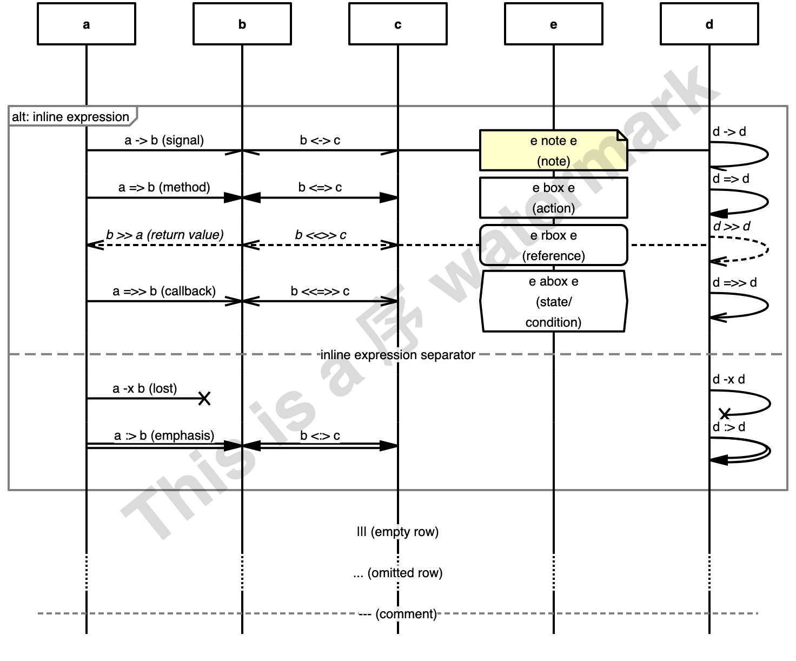
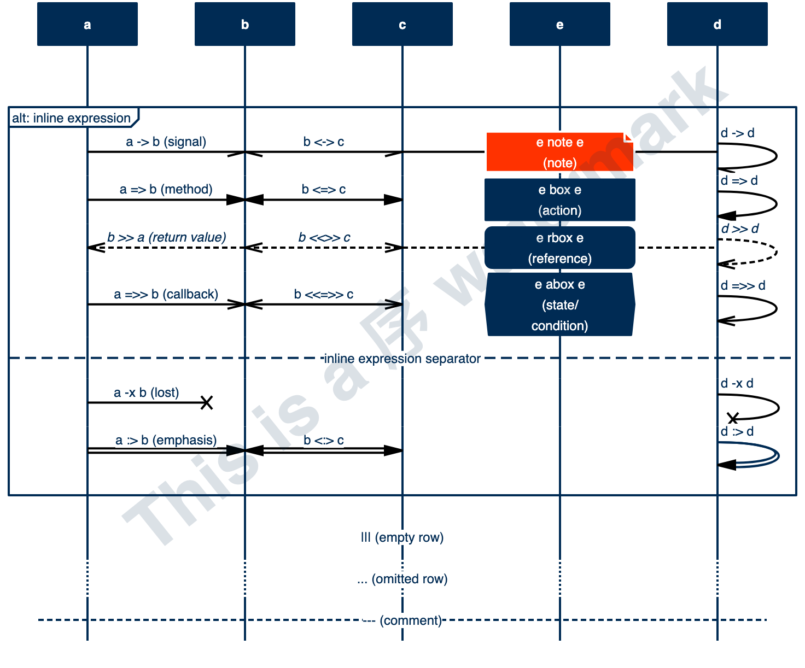
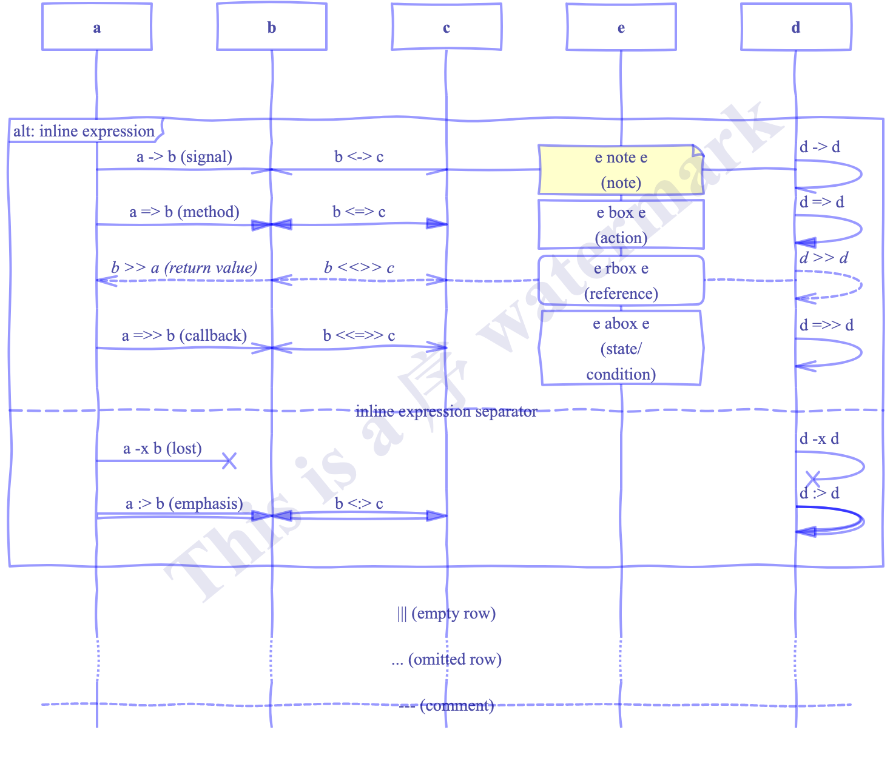

### default
Which is what you get when you don't pass a named style option.


### lazy


### classic


### cygne


### pegasse


### inverted


### fountainpen
(note: experimental)



### input used
```
# MsGenny: a cheat sheet
hscale=0.9, watermark="This is a 序 watermark";

a alt d : inline expression {

    a -> b   : a -> b  (signal),
    b <-> c  : b <-> c,
    c -- d   : c -- d,
    d -> d   : d -> d,
    e note e : e note e \n(note);

    a => b   : a => b  (method),
    b <=> c  : b <=> c,
    d => d   : d => d,
    e box e  : e box e\n(action);

    b >> a   : b >> a (return value),
    b <<>> c : b <<>> c,
    c .. d   : c .. d (dotted),
    d >> d   : d >> d,
    e rbox e : e rbox e\n(reference);

    a =>> b   : a =>> b (callback),
    b <<=>> c : b <<=>> c,
    d =>> d   : d =>> d,
    e abox e  : e abox e\n(state/ condition);

    ---: inline expression separator;

    a -x b   : a -x b  (lost),
    d -x d   : d -x d;

    a :> b   : a :> b  (emphasis),
    b <:> c  : b <:> c,
    d :> d   : d :> d;


};
|||      : ||| (empty row);
...      : ... (omitted row);
---      : --- (comment);
```
